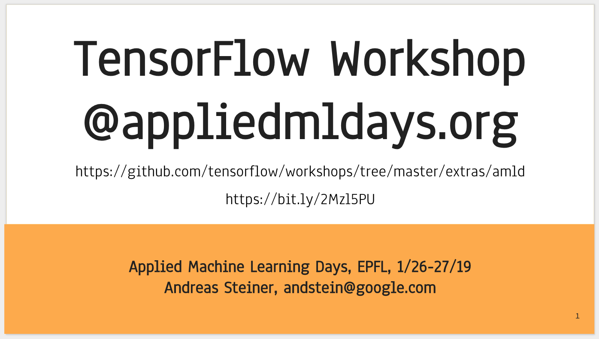

# [AMLD](https://www.appliedmldays.org) TensorFlow Workshop

This workshop was given during the Applied ML days at EPFL (2019):

https://www.appliedmldays.org/workshops/tensorflow-basics-saturday
https://www.appliedmldays.org/workshops/tensorflow-basics-sunday

The workshop shows how to (using TensorFlow 1.12)

- use Colab
- transform a dataset into sharded files of tf.train.Example
- train (linear, convolutional, recurrent) models using Keras
- implement the same functionality using TensorFlow Eager
- do predictions in Python and TensorFlow.js
- train models on Google Cloud

For illustration purposes, the workshop uses the
["Quick, Draw" dataset](quickdraw.withgoogle.com/data), but the provided
Colabs can easily be extended to other data.

(Workshop content by Andreas Steiner, Ruslan Habalov, Megan Ruthven, Bartek Wołowiec)

## Run notebooks on Colab

While most of the provided notebooks also run on Jupyter, some functionality
(like access to Drive or Cloud storage, or interactive predictions) is only
available in [Colaboratory](https://colab.research.google.com).

* [0_colab.ipynb](https://colab.research.google.com/github/tensorflow/workshops/blob/master/extras/amld/notebooks/exercises/0_colab.ipynb)
* [1_data.ipynb](https://colab.research.google.com/github/tensorflow/workshops/blob/master/extras/amld/notebooks/exercises/1_data.ipynb)
* [2_keras.ipynb](https://colab.research.google.com/github/tensorflow/workshops/blob/master/extras/amld/notebooks/exercises/2_keras.ipynb)
* [3_eager.ipynb](https://colab.research.google.com/github/tensorflow/workshops/blob/master/extras/amld/notebooks/exercises/3_eager.ipynb)
* [4_predict.ipynb](https://colab.research.google.com/github/tensorflow/workshops/blob/master/extras/amld/notebooks/exercises/4_predict.ipynb)
* [5_cloud.ipynb](https://colab.research.google.com/github/tensorflow/workshops/blob/master/extras/amld/notebooks/exercises/5_cloud.ipynb)

Note that these notebooks depend on being run in order because earlier notebooks
will download files and write shared Python code to the local filesystem and
later notebooks depend on these files.

If you get stuck with the exercises, you can checkout the "solution" notebooks:

* [0_colab.ipynb](https://colab.research.google.com/github/tensorflow/workshops/blob/master/extras/amld/notebooks/solutions/0_colab.ipynb)
* [1_data.ipynb](https://colab.research.google.com/github/tensorflow/workshops/blob/master/extras/amld/notebooks/solutions/1_data.ipynb)
* [2_keras.ipynb](https://colab.research.google.com/github/tensorflow/workshops/blob/master/extras/amld/notebooks/solutions/2_keras.ipynb)
* [3_eager.ipynb](https://colab.research.google.com/github/tensorflow/workshops/blob/master/extras/amld/notebooks/solutions/3_eager.ipynb)
* [4_predict.ipynb](https://colab.research.google.com/github/tensorflow/workshops/blob/master/extras/amld/notebooks/solutions/4_predict.ipynb)
* [5_cloud.ipynb](https://colab.research.google.com/github/tensorflow/workshops/blob/master/extras/amld/notebooks/solutions/5_cloud.ipynb)

## Run notebooks locally

Alternatively, you can also install
[TensorFlow](https://www.tensorflow.org/install/) on your local machine, clone
this repository, and then run [Jupyter](jupyter.org/install) locally.

