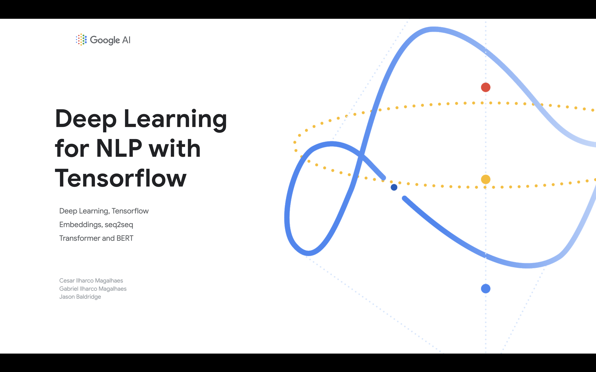

# [KDD2019](https://www.kdd.org/kdd2019/) Deep Learning for NLP with Tensorflow

Hands-on tutorial at KDD, August 7th 2019:

https://www.kdd.org/kdd2019/hands-on-tutorials

TensorFlow will be used for a hands-on experience with the latest NLP
techniques. Starting with a practical introduction to the framework, attendees
will get familiar with core APIs, Colab and best practices for data and training
pipeline. The classic NLP topics of Embeddings, seq2seq, attention and Neural
Machine Translation will be covered, as well as the modern deep learning
architectures of Transformer, BERT and XLNet. Participants will get exposed to
foundational NLP theory and state-of-the-art models, understand them
conceptually and apply them to practical problems, for instance by fine-tuning
pretrained BERT models.

Workshop content by Cesar Ilharco Magalhaes, Gabriel Ilharco Magalhaes and Jason
Baldridge.

## Run notebooks on Colab

The provided notebooks are intended to be run on
[Colaboratory](https://colab.research.google.com).

*   [Tensorflow quickstart](https://colab.research.google.com/github/tensorflow/docs/blob/master/site/en/r2/tutorials/quickstart/beginner.ipynb)
*   [Neural Machine Translation with Attention](https://colab.research.google.com/github/tensorflow/tensorflow/blob/master/tensorflow/contrib/eager/python/examples/nmt_with_attention/nmt_with_attention.ipynb)
*   [Transformer model for language understanding](https://colab.research.google.com/github/tensorflow/docs/blob/master/site/en/r2/tutorials/text/transformer.ipynb)
*   [BERT fine-tuning and inferences with Cloud TPU](https://colab.research.google.com/github/tensorflow/tpu/blob/master/tools/colab/bert_finetuning_with_cloud_tpus.ipynb)

