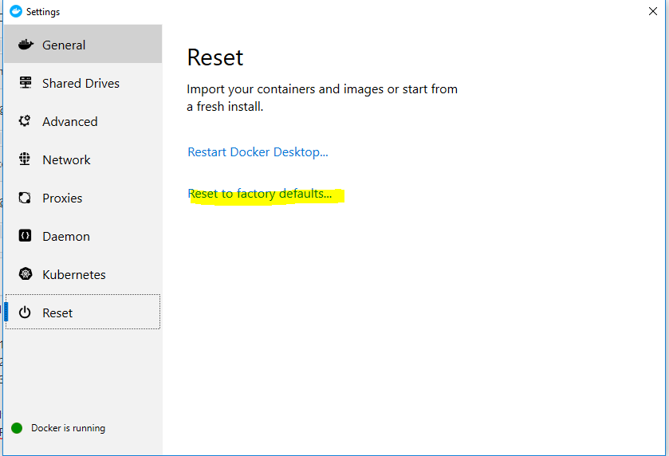

# Windows Notes

Windows is a bit challenging to use, but it's possible to make it work.  These notes should help.

## Preliminaries
* Must use Windows 10 Pro or better (Not Home Edition)
* Must have Adminstrator access

## Steps
1. Install [Git for Windows](https://gitforwindows.org/)
1. Clone this repo https://github.com/tensorflow/workshops.git
1. Open ports (if they're not already open) `445, 6006, 8080, 8888`
1. Stop any running processes currently using those ports
1. **(Requires Adminstrator access)** Edit `C:\windows\system32\drivers\etc\hosts` on Windows and add:

    `127.0.0.1 localunixsocket.local`
    * [Instructions for editing your hosts file](https://www.groovypost.com/howto/edit-hosts-file-windows-10/)
1. Install stable version of [Docker Desktop](https://hub.docker.com/editions/community/docker-ce-desktop-windows) for Windows
1. Make sure that Docker is set for using Linux containers:
    * https://docs.docker.com/docker-for-windows/
    * https://docs.microsoft.com/en-us/virtualization/windowscontainers/deploy-containers/linux-containers
1. [Share the drive](https://docs.docker.com/docker-for-windows/#shared-drives) in Docker settings.  You may need to reset to factory defaults:

1. In Powershell, run `git pull 
1. Start the **Git Bash** tool (a version of MINGW64) which comes with Git for Windows
1. In `Git Bash`, navigate to the `tfx_airflow` directory under the repo you cloned in step 2
1. In `Git Bash`, run `source start_container.sh`
1. When the container starts it will put you in a bash shell inside the container as the `root` user
1. In that shell (inside the container) run `source setup_demo.sh`
1. After the `setup_demo.sh` script does some installs it will ask you to create a password for Jupyter.  Choose a password, or just hit return for no password.

## Note
The terminal is messed up:
* no prompt
* really narrow
* ... but it actually works.  Type commands carefully.
